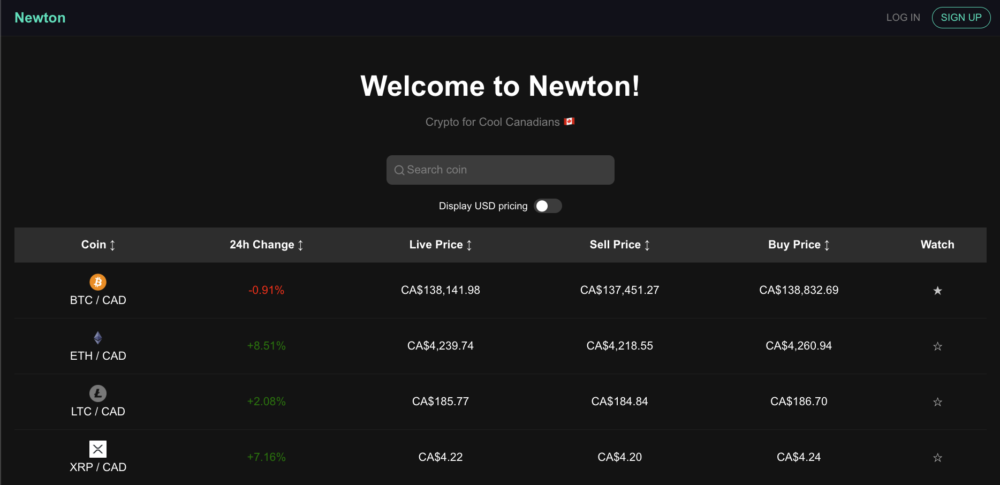

# Newton Take Home Assignment Crypto Dashboard

A **real-time cryptocurrency price dashboard** with WebSocket updates, watchlist functionality, and a modern UI.



## 🚀 Features
- **Live Crypto Prices** (WebSocket-powered)
- **Sortable Table** (By price, 24h change, etc.)
- **Watchlist** (Persisted in `localStorage`)
- **USD/CAD Toggle** (Switch between USD & CAD pricing)
- **Newton-style UI** (Custom header, buttons, and styling)

---

## 📂 Project Structure

```
.
├── backend/        # WebSocket server (Node.js)
│   ├── server.js   # Main server file
│   ├── fetch_logos.py  # Script to fetch coin logos
│   ├── package.json # Backend dependencies
│   ├── package-lock.json
│   └── README.md
│
├── frontend/       # React App (Frontend)
│   ├── public/     # Static assets (logos, favicon, etc.)
│   ├── src/        # React Components & Styles
│   ├── package.json # Frontend dependencies
│   ├── package-lock.json
│   └── README.md
│
├── instructions.pdf  # Take Home Assignment Instructions
└── README.md         # This file
```

---

## ⚙️ **Setup & Installation**

### **1️⃣ Clone the Repository**
```sh
git clone https://github.com/dylanpulver/newton-takehome.git
cd newton-takehome
```

### **2️⃣ Install Dependencies**
#### Backend:
```sh
cd backend
npm install
```
#### Frontend:
```sh
cd frontend
npm install
```

---

## ▶️ **Running the App**

### **Start the Backend (WebSocket Server)**
```sh
cd backend
node server.js
```

### **Start the Frontend (React App)**
```sh
cd frontend
npm start
```

The frontend will run on **`http://localhost:3001/`** and the backend will be available at **`http://localhost:3000/`**.

---

## 🛠 **Tech Stack & Design Decisions**

### **Why Node.js for the Backend?**
- **WebSocket Support**: Node.js provides efficient WebSocket handling via the `ws` package.
- **Asynchronous & Non-Blocking**: Ideal for handling real-time streaming data.
- **Lightweight & Scalable**: Works well for real-time crypto data streaming.

### **Why React for the Frontend?**
- **Component-Based Architecture**: Easier to manage UI state (e.g., watchlist, sorting, and WebSocket integration).
- **Fast Rendering**: React’s virtual DOM makes updates efficient.
- **Modern UI**: Supports interactive features like sorting, filtering, and real-time price updates.

### **Why CoinGecko for Market Data?**
- **Free API (No API Key Needed)**: Reduces setup friction.
- **Comprehensive Crypto Listings**: Covers all required assets.
- **Reliable Data Source**: Frequently updated price feeds.

### **Real-Time Pricing Strategy**
- **Initial Prices Pulled from CoinGecko**: Ensures accuracy at startup.
- **Simulated Price Updates**: Uses controlled volatility and trends for real-time changes.
- **Limits on Fluctuations**: Prevents unrealistic price jumps outside a set range.

---

## 🔧 **Development Notes**
- **To fetch and update crypto logos**, run:
  ```sh
  cd backend
  python fetch_logos.py
  ```
- **Watchlist is stored in `localStorage`** and persists across page refreshes.
- **Sorting icons toggle between neutral, ascending, and descending states**.

---

## 🎯 **Next Steps**
- ✅ **Deploy the frontend** (Vercel/Netlify)
- ✅ **Deploy the backend** (Heroku/Render)
- ✅ **Improve UI (More styling, dark/light mode)**

---

## 🤝 **Contributing**
1. Fork the repo
2. Create a new branch (`git checkout -b feature-branch`)
3. Commit changes (`git commit -m "Added a new feature"`)
4. Push (`git push origin feature-branch`)
5. Open a PR!

---

## 🎉 **Final Thoughts**
I truly enjoyed building this take-home assignment and designing a real-time crypto dashboard. I am excited about the opportunity to work at **Newton** and contribute to its mission in the crypto space. I look forward to discussing this further and appreciate the chance to showcase my work!

🚀 **Thanks for reviewing my submission!**
